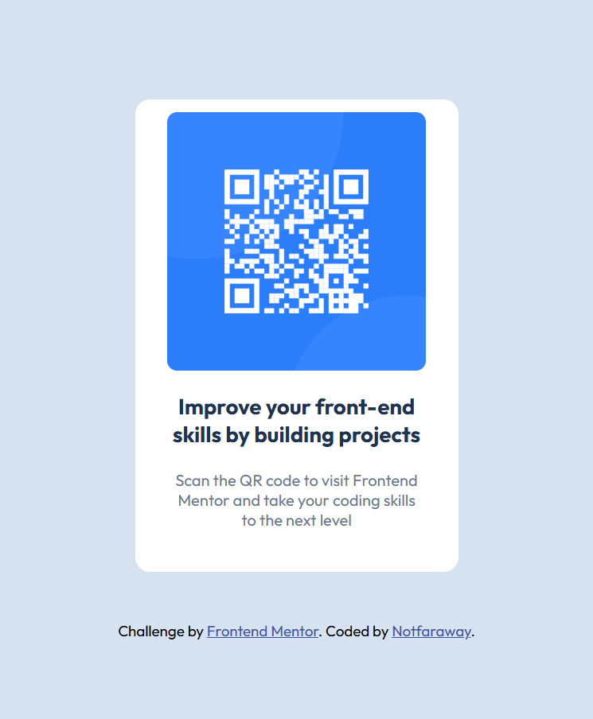

## Table of contents

- [Overview](#overview)
  - [Screenshot](#screenshot)
- [My process](#my-process)
  - [Built with](#built-with)
  - [What I learned](#what-i-learned)
- [Author](#author)
- [Acknowledgments](#acknowledgments)

## Overview

Tihs is a perfect first challenge from Frontend Mentor for me to practise HTML and CSS.

### Screenshot

This is the Screenshot of desktop QR code.<br>
<br>
This is the Screenshot of mobile QR code.<br>


## My process

### Built with

- Semantic HTML5 markup
- CSS custom properties
- CSS Media Queries
- Flexbox

### What I learned

In HTML, `<br>` can be used to break a line. And I can use backticks to display`<br>`as plain text.

```html
<p class="improve">Improve your front-end <br />skills by building projects</p>
```

In CSS, the following code can be used to center a div.

```css
.div1 {
  margin: auto;
  border: 3px solid white;
  padding: 10px;
}
```

## Author

- Frontend Mentor - [@notfafraway](https://www.frontendmentor.io/profile/notfaraway)

## Acknowledgments

My version:
This challenge lets me learn a lot.I am a junior.But it is the first time that I use git and Github.My first language is Chinese rather than English.So reading the content of the Frontend Mentor website is really challenging for me.But I made it!
Thanks to Frontend Mentor!

AI corected & polished version:
This challenge has taught me a lot. I am a junior in college, and this is the first time I have used Git and GitHub. My first language is Chinese, not English, so reading the content on the Frontend Mentor website was really challenging for me. But I made it! Thanks to Frontend Mentor!

See!It also improves my English!
